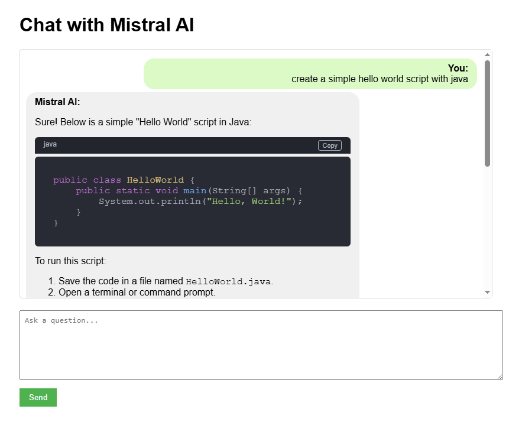

# Mistral AI Chat Application

A simple web application that lets users chat with Mistral AI. The application uses Express.js for the backend and features a clean UI with code block rendering capabilities.

## Features

- Real-time chat with Mistral AI
- Code block detection and syntax highlighting
- Copy code functionality
- Loading animation while waiting for responses
- Session management for conversation history

## Technologies Used

- Express.js
- EJS templates
- Mistral AI API
- highlight.js for code syntax highlighting
- marked.js for markdown parsing

## Setup

1. Clone the repository
2. Install dependencies: `npm install`
3. Create a `.env` file with your Mistral AI API key: MISTRAL_API_KEY=your_api_key_here

4. Start the server: `npm start`
5. Open http://localhost:3000 in your browser

## Screenshots

## License

MIT